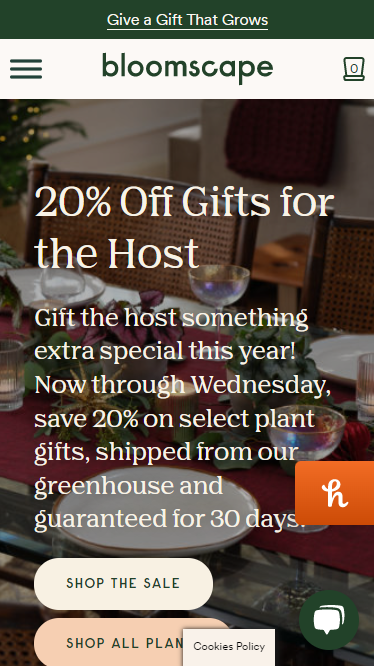
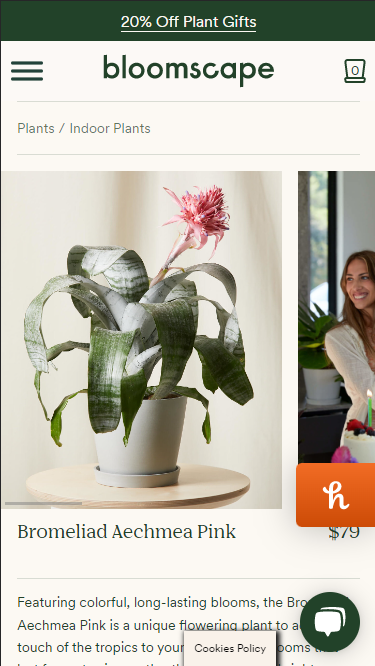

# Procesverslag
Markdown is een simpele manier om HTML te schrijven.  
Markdown cheat cheet: [Hulp bij het schrijven van Markdown](https://github.com/adam-p/markdown-here/wiki/Markdown-Cheatsheet).

Nb. De standaardstructuur en de spartaanse opmaak van de README.md zijn helemaal prima. Het gaat om de inhoud van je procesverslag. Besteedt de tijd voor pracht en praal aan je website.

Nb. Door *open* toe te voegen aan een *details* element kun je deze standaard open zetten. Fijn om dat steeds voor de relevante stuk(ken) te doen.

## Jij

  
uitwerken voor kick-off werkgroep

  ### Auteur:
  Tim Koelewijn

  #### Je startniveau:
  Rode Piste

  #### Je focus:
  Responsive
 

## Je website

  
uitwerken voor kick-off werkgroep

  ### Je opdracht:
  https://bloomscape.com/

  #### Screenshot(s) van de eerste pagina (small screen): 
  Home pagina | https://bloomscape.com/
  

  #### Screenshot(s) van de tweede pagina (small screen):
  Product uitlichting | https://bloomscape.com/product/bromeliad-aechmea-pink/
  
 

## Toegankelijkheidstest 1/2 (week 1)

  
uitwerken na test in 1e werkgroep

  ### Bevindingen
  Lijst met je bevindingen die in de test naar voren kwamen:
  > de mogelijkheid om het menu te skippen met tab's.
  > Juist contrastverhoudingen.
  > hover state mag wat duidelijker is een klein tintje donkerder waardoor het niet zo goed zichtbaar is.

  #### Screenreader
  Screenreader werkt uitstekend.
  De enige negatieve onderdeel dat iik tegenkwam is dat de alt tekst van de afbeelding voluit wordt uitgesproken, de abeeldingen hadden te specifieke namen dat korter kon. 

  Hier een omschrijving van hoe het opgelost kan worden (met indien nodig afbeeldingen)
  Afbeelding in 1-3 enkle woord(en) die de afbeelding omschrijven.

  #### Muis en Toetsenbord 
  Hier korte omschrijving (met indien nodig afbeeldingen)

  Hier een omschrijving van hoe het opgelost kan worden (met indien nodig afbeeldingen)

  #### Motoriek (shocks, elastiekjes)
  Ik had de schokappraat geruikt, daarmmee kun je de website niet normaal bedienen, dit kon via taps was mogelijk alleen de buttons was nouwelijk zichtbaar 

  Hier een omschrijving van hoe het opgelost kan worden (met indien nodig afbeeldingen)
  focus state een andere kleur geven een duidelijke border geven die duidelijk laat zien waar jij momenteel bevind.

  #### Visueel (brillen, contrast, kleurenblind, dark/light). 
  Hier korte omschrijving (met indien nodig afbeeldingen)
  de buttons mogen wat duidelijker, sommige buttons hebben dezlefde kleur als de achtergrond waardoor de slechtziende minder goed onderscheid kan maken.

  Hier een omschrijving van hoe het opgelost kan worden (met indien nodig afbeeldingen)
  De buttons waarmee je interacties kunt opdoen een eigen kleur ontvangen.

## Breakdownschets (week 1)

  
uitwerken na afloop 2e werkgroep

  ### de hele pagina: 
  

  ### dynamisch deel (bijv menu): 
  

  ### wellicht nog een dynamisch deel (bijv filter): 
  

## Voortgang 1 (week 2)

  
uitwerken voor 1e voortgang

  ### Stand van zaken
  hier dit ging goed & dit was lastig (neem ook screenshots op van delen van je website en code)
  De eerste week had ik html gedaan voor mijn gevoel ging het goed. liep wel achter 

  ### Agenda voor meeting
  samen met je groepje opstellen | Gezammelijk kozen wij een momentje samen om onze voortgang te bespreken.

  | Tim            | student 2          | student 3    | student 4        |
  | ---            | ---                | ---          | ---              |
  | Mag je bij onderstreepte woord een u element gebruiken?     | en dit             | en ik dit    | en dan ik dat    |
  | Mag je bij schuingedrukt woord een em, i element gebruiken? | dit als er tijd is | nog een punt | dit wil ik zeker |
  | Hoe werken radio buttons | ...                | ...          | ...              |
  | Wat is de correcte manier om een hamburger icoontje te maken? | ...                | ...          | ...              |

  ### Verslag van meeting
  hier na afloop snel de uitkomsten van de meeting vastleggen

  - De titel had ik verkeerd gedaan, voor de screenreader is het handig als er een duidelijke titel is (maar is dan wel onzichtbaar).
  - Gebruik van artikel is verkeerd, moest helemaal geen artikle zijn.
  - Subtiels zijn allemaal h2.
  - de volgorde op sommige plekken anders.

## Voortgang 2 (week 3)

  
uitwerken voor 2e voortgang

  ### Stand van zaken
  Tijdens deze werkgroep geen voortgang op mijn werk aangebracht, alleen groene balk boven aan de pagina, meer niet.

  ### Agenda voor meeting
  samen met je groepje opstellen | Gezammelijk kozen wij een momentje samen om onze voortgang te bespreken.

  | Tim     | student 2          | student 3    | student 4        |
  | ---            | ---                | ---          | ---              |
  | Geen vragen opgesteld  | en dit             | en ik dit    | en dan ik dat    |
  |                | dit als er tijd is | nog een punt | dit wil ik zeker |
  |                | ...                | ...          | ...              |

  ### Verslag van meeting
  hier na afloop snel de uitkomsten van de meeting vastleggen

  - Geen, omdat ik geen voortuigang had geboekt.

## Toegankelijkheidstest 2/2 (week 4)

  
uitwerken na test in 8e werkgroep

  ### Bevindingen
  Lijst met je bevindingen die in de test naar voren kwamen (geef ook aan wat er verbeterd is):

  #### Screenreader
  Eerlijk gezegd, kon dit beter alleen weet ik niet helemaal hoe. Er zijn stukken wat de vertellen voledig leest, maar stopt vervolgens met spreken.
  Kun je moeilijk een volgende stukje tekst aan klikken. Als oplossing functies toevoegen die te besturen zijn met een toetsenbord, zodat je met de toetsenbord door alle teksten kunt navigeren.

  nu pakt het alle butten en linkjes met het toestenbord, maar slaat p-jes bijv. over en die worden ook niet opgelezen.

  logo afbeeldingen (in "As seen in"), in de beschrijving zetten dat het om een logo gaat, dit is nu niet duidelijk.

  #### Muis en Toetsenbord 
  > Alle mogelijke en belangerijke ineteracties zijn met alleen te toetsenbord te bedienen
  > Met de muis volledig toegangelijk (als ik het onderdeel muis goed heb begrepen)

  #### Motoriek (shocks, elastiekjes)
  Motoriek blijft een lastig onderdeel, je kunt met de toetsenbord werken, wat een betere oplossing is een spraakfunctie eraan toevoegen die doormiddel van je stem door de website kunt navigeren.

  aantal bevindingen:
  > De knoppen zijn groot en zijn hierdoor moelijker te missen.
  > Gebruiker kan met toetsenbord besturen en hierdoor makkelijker bij kleine onderdelen komen (zoals het kiezen van een kleur).

  #### Visueel (brillen, contrast, kleurenblind, dark/light). 
  > Met het checken van het contrast zit alles goed.
  > Met het veranderen van kleuren op het scherm waren sommige plekken iets lastiger te lezen (bijv. als je over een button hovert), dit heb ik opgelost een tegengestelde kleur eraan toe te voegen als je erop focust en hovert. zo ziet de gebruiker dat er interactie mee kan worden gevoerd.
  > Gebruik gemaakt van redelijk grote teksten zodat het beter leesbaar is voor slechtziende.
  > Duidelijke grote knoppen, ze zijn goed leesbaar en opvallend.
  > sommig leesteksten zijn door de lettertype iets minder goed leesbaar, beter is om een meer dikgedrukte font te kiezen.

## Voortgang 3 (week 4)

  
uitwerken voor 3e voortgang

  ### Stand van zaken
  Na een hele vakantie eraan zitten werken heb ik de basis zo goed als af, bleek achteraf nog een hoop moet gaan doen.

  ### Agenda voor meeting
  samen met je groepje opstellen | Gezammelijk kozen wij een momentje samen om onze voortgang te bespreken.

  | student 1      | student 2          | student 3    | student 4        |
  | ---            | ---                | ---          | ---              |
  | hoe kan ik een video (iframe) responsive maken,  maar wel een 16:9 ratio behouden? | en dit             | en ik dit    | en dan ik dat    |
  | Uitleggen hoe radio button in eigen stijl te werk gaat. | dit als er tijd is | nog een punt | dit wil ik zeker |
  | hoe tekst veranderen wanneer je met je muis (hover) over een radio button heen gaat?          | ...                | ...          | ...              |
  | kun je de volgorde wijzigen (order) zonder gebruikt te maken van een flex of grid?          |

  ### Verslag van meeting
  hier na afloop snel de uitkomsten van de meeting vastleggen;

  - Antwoord op donkere overlap op de achtergrondsafbeelding plaatsen
  - Tekst dat veranderd op de keuze van radio buttons
  - nog een punt
  - ...

## Eindgesprek | Herkansing

  
uitwerken voor eindgesprek

  ### Je uitkomst - karakteristiek screenshots:
  
  

  ### Dit ging goed/Heb ik geleerd: 
  waar ik trots op ben is de opbouw van dit onderdeel (zie afbeelding), net als het responsive maken tussen desktop weergave en mobiele weergave.
  

  ### Dit was lastig/Is niet gelukt:
  Eingesprek| Helaas zijn veel dingen niet gelukt wat ik wil bereiken o.a. 2 pagina. Waar ik veel (te) tijd heb ingestoken is de menubalk dat niet werkt of na ja de vormgeving is verkeerd (in desktop weergave).

  Herkansing | Ondertussen heb ik voor alles een oplossing verzonnen en toegepast wat eerst niet lukte, Wat helaas momenteel niet gelukt is om namen van de gekozen radio button bij iedere product te laten veranderen, werkte alleen bij 1 product. Na verschillende dingen te proberen heb ik het maar bij 1 product gehouden.
  
  

## Bronnenlijst

  
continu bijhouden terwijl je werkt

  Nb. Wees specifiek ('css-tricks' als bron is bijv. niet specifiek genoeg).

  1. https://moderncss.dev/pure-css-custom-styled-radio-buttons/ | heeft mij geholpen om custum radio buttons te maken.
  2. https://www.w3schools.com/howto/howto_css_responsive_iframes.asp | Heeft mij geholpen om een responsive video frame te maken.
  3. https://css-tricks.com/snippets/css/a-guide-to-flexbox/ | Begrijpen van flexbox.
  4. https://css-tricks.com/snippets/css/complete-guide-grid/ | Begrijpen van grid.
  5. https://www.w3schools.com/howto/tryit.asp?filename=tryhow_js_collapsible_animate | Code over genomen om een uitklapmenu te maken, bij het ontleden ervan niet veel wijzer van geworden.
  6. Aantal producten kiezen, gekeken van oude school opdracht, hoe de javascript ookalweer in elkaar zat.

